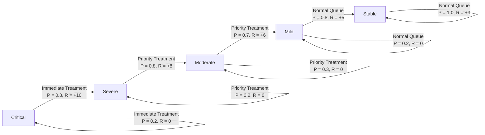

# Representation-of-a-Real-World-Problem-as-a-Markov-Decision-Process


## Aim

To represent a Hospital Emergency Patient Priority System as a Markov Decision Process (MDP) by defining its states, actions, transition probabilities, rewards, and Python representation.

---

## Problem Statement

### Problem Description

In a hospital emergency department, patients arrive with different levels of medical urgency. The system must decide how quickly each patient should receive treatment based on their current condition. The aim is to give faster treatment to serious patients while efficiently managing hospital resources and reducing unnecessary waiting time.

---

## MDP Components

A Markov Decision Process is represented as:

$$
MDP = (S, A, P, R, \gamma)
$$

Where:

| Symbol | Meaning |
|---|---|
| $S$ | Set of patient condition states |
| $A$ | Set of treatment priority actions |
| $P$ | Probability of change in patient condition |
| $R$ | Reward for the treatment decision |
| $\gamma$ | Discount factor for future rewards |
---

## State Space

The state space represents all possible conditions in which a patient can be present in the emergency department.

```text
S = {
    Critical,
    Severe,
    Moderate,
    Mild,
    Stable
}
```

The five states represent the patient's condition from **Critical**, which requires urgent attention, to **Stable**, where the patient's condition is under control.
---

## Sample State

A sample state from the state space is:

**Severe**

This state represents a patient who has a serious medical condition and requires priority treatment.


---

## Action Space

The action space represents all possible treatment decisions available to the system based on the patient's condition.

Example format:

```text
A = {
    Immediate Treatment,
    Priority Treatment,
    Normal Queue
}

```


---

## Sample Action

A sample action selected from the action space is:

Priority Treatment

This action gives higher priority to a patient who requires quicker medical attention.

---

## Transition Probability

The transition probability represents the chance of a patient moving from one medical condition to another after a treatment action is taken.

General form:

$$
P(s' \mid s,a)
$$

For the Hospital Emergency Patient Priority System:

| Current State | Action | Next State | Probability |
|---|---|---|---|
| Critical | Immediate Treatment | Severe | 0.8 |
| Critical | Immediate Treatment | Critical | 0.2 |
| Severe | Priority Treatment | Moderate | 0.8 |
| Severe | Priority Treatment | Severe | 0.2 |
| Moderate | Priority Treatment | Mild | 0.7 |
| Moderate | Priority Treatment | Moderate | 0.3 |
| Mild | Normal Queue | Stable | 0.8 |
| Mild | Normal Queue | Mild | 0.2 |
| Stable | Normal Queue | Stable | 1.0 |

For example, if a patient is in the **Critical** state and receives **Immediate Treatment**, there is a **0.8 probability** of moving to the **Severe** state and a **0.2 probability** of remaining in the **Critical** state.

---

## Reward Function

The reward function defines the feedback received by the system based on the treatment decision and the resulting patient condition.

General form:

$$
R(s,a,s')
$$

For the Hospital Emergency Patient Priority System:

| Current State | Action | Next State | Reward |
|---|---|---|---:|
| Critical | Immediate Treatment | Severe | +10 |
| Critical | Normal Queue | Critical | -10 |
| Severe | Priority Treatment | Moderate | +8 |
| Severe | Normal Queue | Severe | -6 |
| Moderate | Priority Treatment | Mild | +6 |
| Moderate | Normal Queue | Moderate | -3 |
| Mild | Normal Queue | Stable | +5 |
| Stable | Normal Queue | Stable | +3 |

A **positive reward** is given when the correct treatment improves or maintains the patient's condition, while a **negative reward** is given when an unsuitable action delays necessary treatment.

---

## Graphical Representation

The MDP graph represents the change in the patient's condition based on the treatment action taken. The arrows show the **action, transition probability, and reward**.




In the graph:

- **Nodes** represent the patient states.
- **Arrows** represent the treatment actions.
- **P** represents the transition probability.
- **R** represents the reward received.


---

## Python Representation

The Hospital Emergency Patient Priority System can be represented using Python dictionaries as follows:


```python

print("Name: Niralya J ")
print("Register Number:212224230188 ")

# States
states = [
    "Critical",
    "Severe",
    "Moderate",
    "Mild",
    "Stable"
]

# Actions
actions = [
    "Immediate Treatment",
    "Priority Treatment",
    "Normal Queue"
]

# Transition Probabilities
transitions = {
    ("Critical", "Immediate Treatment"): {
        "Severe": 0.8,
        "Critical": 0.2
    },

    ("Severe", "Priority Treatment"): {
        "Moderate": 0.8,
        "Severe": 0.2
    },

    ("Moderate", "Priority Treatment"): {
        "Mild": 0.7,
        "Moderate": 0.3
    },

    ("Mild", "Normal Queue"): {
        "Stable": 0.8,
        "Mild": 0.2
    },

    ("Stable", "Normal Queue"): {
        "Stable": 1.0
    }
}

# Rewards
rewards = {
    ("Critical", "Immediate Treatment", "Severe"): 10,
    ("Critical", "Immediate Treatment", "Critical"): 0,

    ("Severe", "Priority Treatment", "Moderate"): 8,
    ("Severe", "Priority Treatment", "Severe"): 0,

    ("Moderate", "Priority Treatment", "Mild"): 6,
    ("Moderate", "Priority Treatment", "Moderate"): 0,

    ("Mild", "Normal Queue", "Stable"): 5,
    ("Mild", "Normal Queue", "Mild"): 0,

    ("Stable", "Normal Queue", "Stable"): 3
}

# Discount Factor
gamma = 0.9

# Display the MDP
print("\nStates:")
print(states)

print("\nActions:")
print(actions)

print("\nTransition Probabilities:")
for state_action, next_states in transitions.items():
    print(state_action, "->", next_states)

print("\nRewards:")
for transition, reward in rewards.items():
    print(transition, "->", reward)

print("\nDiscount Factor:", gamma)

---
``` 
## Output


---

## Result

Thus, the Hospital Emergency Patient Priority System was successfully represented as a Markov Decision Process using 5 states and 3 actions. The MDP helps the system decide the appropriate treatment priority based on the patient's condition, with the goal of providing faster care to serious patients and moving patients toward a stable condition.


---

